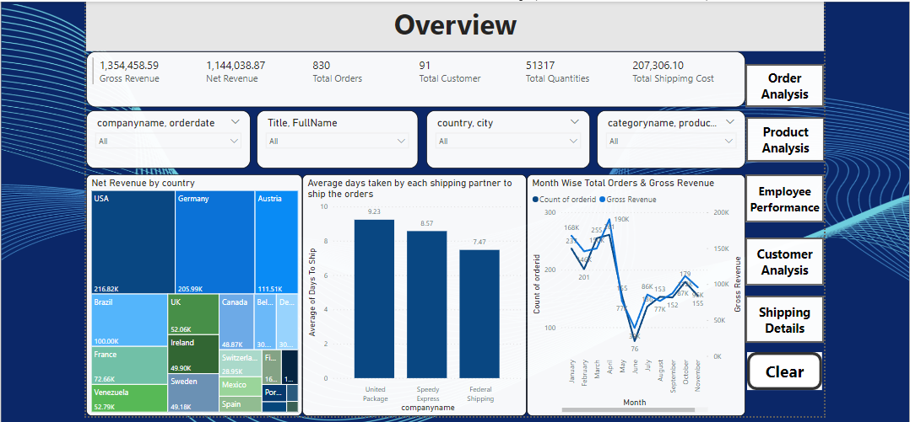

## *Project Title: Sales and Business Performance Dashboard using Power BI*

### *Objective:*

To analyze and visualize key business data across orders, products, customers, employees, and shipping to gain actionable insights that help improve revenue, operational efficiency, and customer satisfaction.

---

### *Questions(KPIs):*
1. What is the overall gross and net revenue generated?
2. Who are the top-performing and underperforming employees?
3. Which product categories generate the most and least revenue?
4. How do sales vary across different countries and time periods?
5. Which customers and regions are the most profitable?
6. What is the performance of different shipping partners in terms of cost and delivery time?
7. What are the monthly and yearly sales trends?

---

### *Key Performance Indicators (KPIs):*
* Total Orders: 2,155
* Gross Revenue: \$1,354,458.59
* Net Revenue: \$1,144,038.87
* Total Discount Given: \$3,113.62
* Total Shipping Cost:\$207,306.10
* Total Customers: 91
* Total Countries Served: 21
* Average Shipping Days per Partner
* Employee KPI Status (Exceeded / Underperformed)

--- 

### *Process Followed:*

1. *Data Collection:*

   * Dataset used:<a href= "https://www.kaggle.com/api/v1/datasets/download/matthuan/northwind-dataset"> Northwind Traders Data</a>

3. Data Cleaning & Transformation:

   * Null handling and data type corrections.
   * Relationship establishment between tables (Orders, Products, Customers, Employees, Shippers, etc.)

4. Data Modeling in Power BI:

   * Created data model with appropriate primary and foreign key relationships.
   * Used DAX for calculated columns and measures (e.g., Gross Revenue, Net Revenue, Discounts, KPIs).

5. Data Visualization:

   * Built interactive dashboards segmented into:

     * Order Analysis
     * Product Analysis
     * Employee Performance
     * Customer Analysis
     * Shipping Details
     * Overview Dashboard
       
--- 

### *Dashboard:*

---

### *Project Insights:*

* *Top Product Category:* Beverages generated the highest revenue (\~\$286K).
* *Top Employee:* Sales representatives significantly outperformed other job roles in terms of revenue generated.
* *Best Performing Customer:* QUICK-Stop contributed the most in revenue (\~\$117K).
* *Top Countries by Revenue:* USA and Germany led in net revenue contributions.
* *Underperforming Products:* Items like Chocolate and Gravad lax showed lower order counts and revenue.
* *Shipping Analysis:* United Package had the highest shipping cost but also longer average delivery time (\~9.23 days).
* *Sales Trend:* Peak gross revenue was observed in mid-1997; seasonal variation and dips observed in later months.

---

### *Final Conclusion:*

This Power BI project enabled a comprehensive analysis of company performance across multiple business domains. It helped identify top products, key customers, efficient employees, and shipping inefficiencies. With this insight, businesses can optimize their operations by focusing on high-performing segments, improving logistics, and strategizing around customer behavior for better revenue generation.
